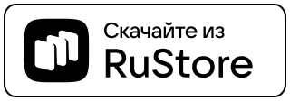

# android_reader

Меня очень долго привлекала тема приложений для чтения книжек. Поэтому еще год назад небольшое приложение на базе [Ридиума](https://github.com/readium/kotlin-toolkit). 
Правда без OPDS, выделения текста и поиска (никогда ими не пользовался). Оно довольно простое. Умеет открывать `.pdf` и `.epub` файлы и сохранять их в свою библиотеку. Запоминает прогресс чтения, а также в нем можно делать закладки. Конечно-же есть темная тема. Все сделано с более-менее современными технологиями и практиками (coroutines, androidx.splashscreen, jetpack compose), но пока без KMM версии для ПК.

Скачать можно в следующих магазинах:

 

 

Скриншоты:

  
&nbsp; &nbsp; &nbsp; &nbsp;
  

